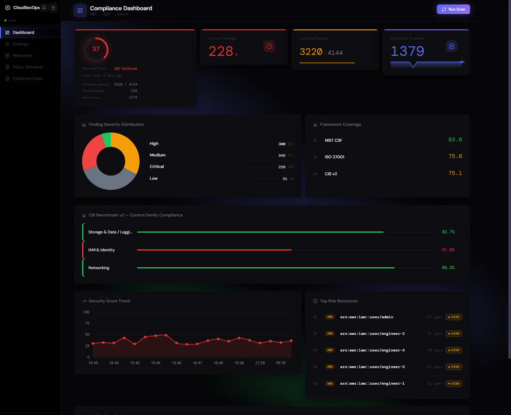
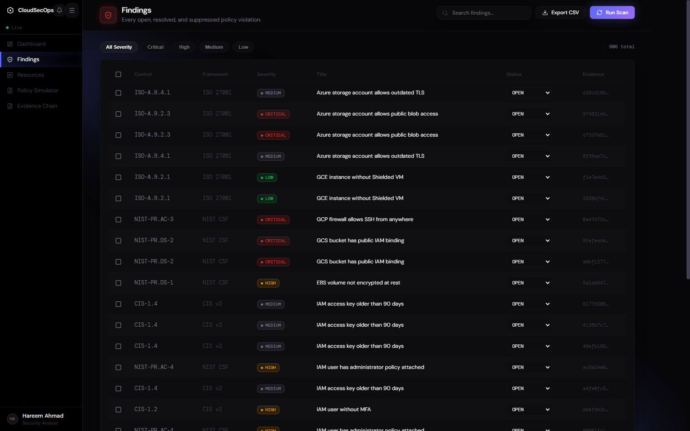
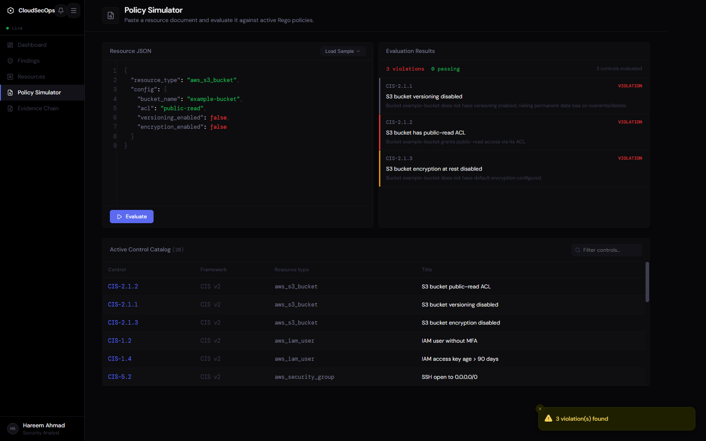
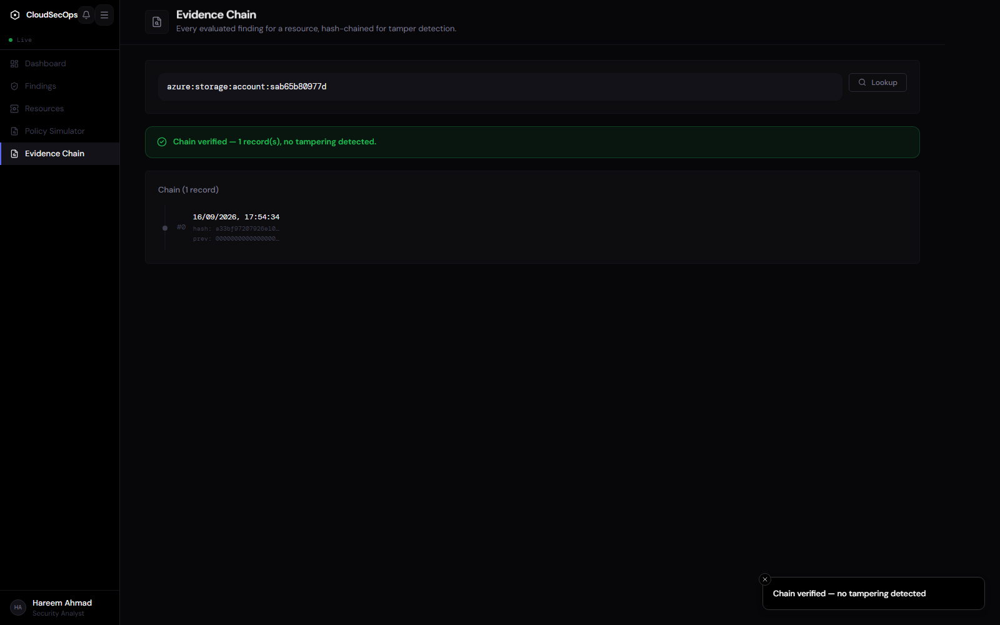
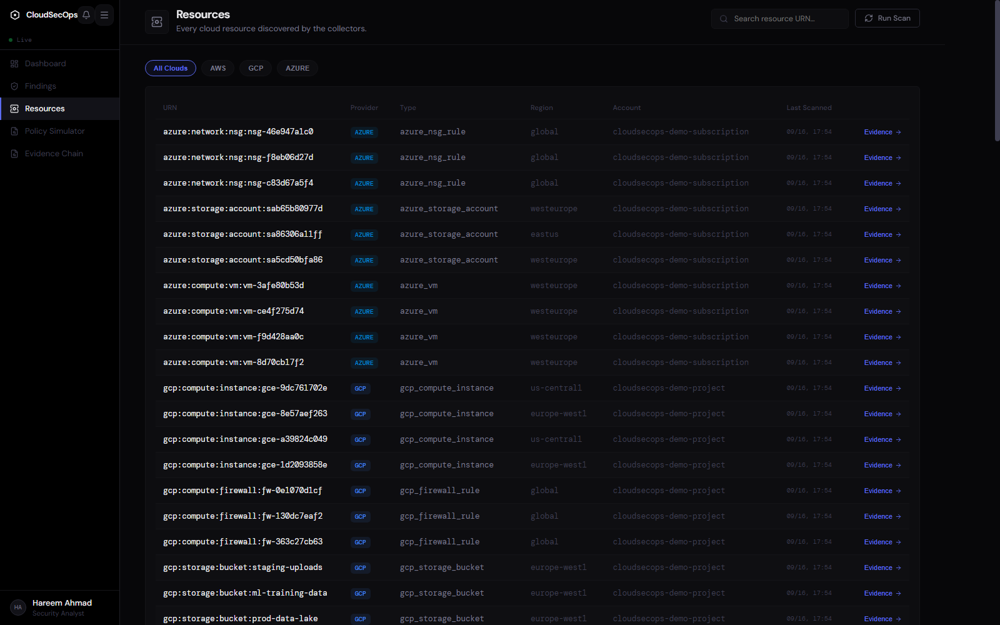
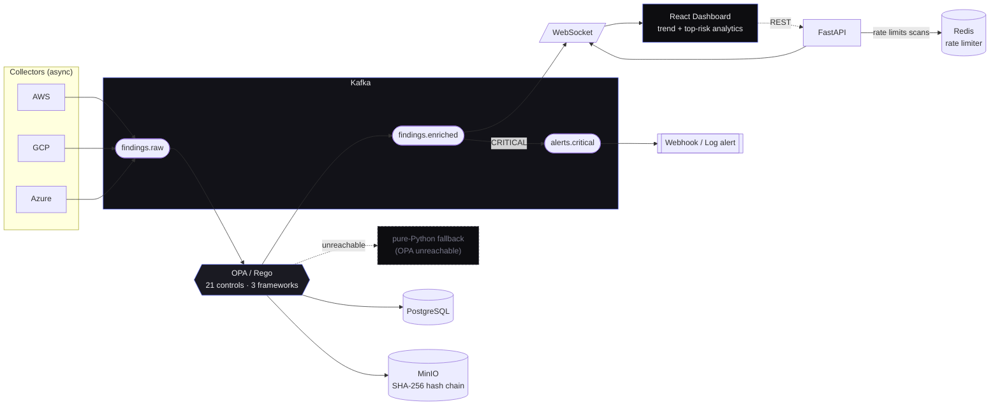

<div align="center">



<a href="https://github.com/Gi-v/cloudsecops-pipeline/actions/workflows/ci.yml"></a>


<br/>


<br/><br/>

<a href="https://readme-typing-svg.demolab.com/">
  
</a>

</div>

<p align="center"><b>Hareem Ahmad</b> · ArZens Security Engineering Internship 2025</p>

<p align="center">
Continuously inventories AWS/GCP/Azure resources, evaluates every one against
CIS Benchmark v2, NIST CSF, and ISO 27001 controls through an OPA/Rego policy engine,
and writes every finding to a tamper-evident SHA-256 hash-chained evidence store —
replacing a manual, spreadsheet-driven cloud audit with a real-time event pipeline.
</p>

<p align="center">
  <a href="#-live-dashboard">Screenshots</a> ·
  <a href="#-quick-start">Quick start</a> ·
  <a href="#-architecture">Architecture</a> ·
  <a href="#-what-it-does">Features</a> ·
  <a href="#-verification">Verification</a> ·
  <a href="ARCHITECTURE.md">Full design doc</a>
</p>

---

## 📸 Live dashboard

<table>
<tr>
<td width="50%">

**Compliance Dashboard**
Security score (colored by its own compliance band, not a fixed color), a real "N min ago" last-scan time, a real critical-count trend chip, severity breakdown, framework coverage, a score-over-time trend with a real resources-scanned sparkline, top-risk resources, and a live WebSocket findings feed — every number on this page comes from a real scan, including the small ones.

</td>
<td width="50%">

**Findings**
Filter by severity, search, bulk-resolve, export to CSV — every row backed by an OPA-evaluated policy violation.

</td>
</tr>
<tr>
<td></td>
<td></td>
</tr>
<tr>
<td width="50%">

**Policy Simulator**
Paste any resource JSON and watch it evaluate live against all 21 active Rego controls — no scan required.

</td>
<td width="50%">

**Evidence Chain**
SHA-256 hash-chain verification per resource — tamper-evident by construction, not by policy (ADR-003).

</td>
</tr>
<tr>
<td></td>
<td></td>
</tr>
</table>

<details>
<summary><b>Resources inventory</b> (click to expand)</summary>
<br/>

</details>

---

## 🧭 Architecture



Six independently-scaling stages connected by Kafka rather than direct calls, so a slow
policy evaluation never blocks collection and a dashboard reconnect never blocks
evaluation. Every external dependency degrades gracefully instead of taking the pipeline
down with it: OPA unreachable falls back to an equivalent pure-Python evaluator, MinIO
unreachable falls back to local-disk evidence storage, Redis unreachable falls back to
in-memory rate limiting — the demo runs end-to-end even with zero infra containers up.
Every architectural choice — Kafka as the backbone, Rego as policy-as-code, the
hash-chain evidence design, `asyncio` for collection — has a written decision record in
[`docs/adr/`](docs/adr):

| ADR | Decision |
|---|---|
| [001](docs/adr/ADR-001-kafka-event-backbone.md) | Kafka as the event backbone |
| [002](docs/adr/ADR-002-opa-rego-policy-as-code.md) | OPA/Rego for policy-as-code |
| [003](docs/adr/ADR-003-evidence-store-hash-chain.md) | MinIO + SHA-256 hash chain for evidence |
| [004](docs/adr/ADR-004-asyncio-collection.md) | `asyncio` for cloud resource collection |

Full system design, data flow, and failure-mode handling: **[ARCHITECTURE.md](ARCHITECTURE.md)**.

---

## ✨ What it does

<table>
<tr>
<td width="33%" valign="top">

### 🔍 Collect
Async AWS/GCP/Azure collectors inventory resources concurrently and publish each one to Kafka — no synchronous, region-by-region API crawling.

</td>
<td width="33%" valign="top">

### ⚖️ Evaluate
Every resource is checked against **21 Rego controls** across **CIS v2, NIST CSF, and ISO 27001** by a real OPA server, with a pure-Python fallback if OPA is unreachable.

</td>
<td width="33%" valign="top">

### 🔐 Prove it
Every finding is archived to MinIO as `sha256(payload + prev_hash)` — an append-only chain per resource that a single altered byte anywhere breaks detectably.

</td>
</tr>
<tr>
<td width="33%" valign="top">

### 📡 Broadcast
Enriched findings push to every connected dashboard over a **single shared WebSocket** the moment they're evaluated — no polling, ever.

</td>
<td width="33%" valign="top">

### 🚨 Alert
CRITICAL violations fan out to a dedicated Kafka topic and deliver via webhook (Slack/Discord-compatible) or structured log — never silently dropped.

</td>
<td width="33%" valign="top">

### 🧪 Simulate
The Policy Simulator evaluates arbitrary pasted JSON against the live control catalog instantly — draft a fix and verify it before touching real infrastructure.

</td>
</tr>
</table>

---

## 🚀 Quick start

**Full stack, one command:**

```bash
cp .env.example .env
docker compose up --build
```

| Service | URL |
|---|---|
| 🖥️ Dashboard | http://localhost:5173 |
| 📘 API docs (Swagger) | http://localhost:8000/docs |
| ⚖️ OPA console | http://localhost:8181 |
| 🪣 MinIO console | http://localhost:9001 |

<details>
<summary><b>Backend only, no Docker</b> — everything gracefully falls back to in-process/local-disk when Kafka/OPA/MinIO aren't running</summary>

```bash
cd backend
python -m venv .venv && .venv\Scripts\activate
pip install -r requirements.txt
uvicorn app.main:app --reload
```

See [`backend/README.md`](backend/README.md) for details.
</details>

<details>
<summary><b>Frontend only</b></summary>

```bash
cd frontend
npm install
npm run dev
```
</details>

### Try it

1. Open the dashboard and click **Run Scan** — triggers `POST /api/scan`, which runs all
   three simulated collectors, publishes to `findings.raw`, evaluates every resource
   against the Rego bundle, and republishes enriched results to `findings.enriched`.
2. Watch findings stream into the **Live Findings Feed** in real time — no polling.
3. Open **Findings** to filter by severity, search, or bulk-resolve.
4. Open **Policy Simulator** and paste any resource JSON to see it evaluated against
   every active control instantly.
5. Open **Evidence Chain**, paste a resource URN (copy one from **Resources**), and click
   **Lookup** to see its hash chain and verification result.

---

## 🎭 What's real vs. simulated

| | |
|---|---|
| ✅ **Real** | The FastAPI backend, Kafka pub/sub, OPA policy evaluation (21 Rego controls, unit-tested), the SHA-256 evidence hash chain, the Postgres schema, the WebSocket live feed, and the full React dashboard all run and do exactly what they claim. |
| 🧪 **Simulated by default** | The AWS/GCP/Azure collectors generate a realistic synthetic resource inventory instead of calling real cloud APIs, so the whole pipeline runs and demos with zero cloud accounts. Set `COLLECTOR_MODE=live` and supply credentials to point the AWS collector at a real account — the collector contract is identical either way. |

---

## ✅ Verification

```bash
# Backend — 111/111 passing, 92% coverage (78 need nothing; 33 exercise
# findings/resources/evidence/scan/metrics/the evaluator against a real
# cloudsecops_test Postgres database — `docker compose up -d postgres`
# first, then create it once:
#   PGPASSWORD=cloudsecops_dev_password psql -h localhost -U cloudsecops \
#     -d cloudsecops -c "CREATE DATABASE cloudsecops_test"
cd backend && pytest -q
ruff check app && mypy app

# Frontend — 109/109 passing
cd frontend && npm test
npx tsc -b --noEmit && npx eslint . && npm run build
```

Every dependency in this repo is pinned to its current stable release (FastAPI 0.141,
React 19, Vite 8, OPA 1.20, ...) and the whole stack was driven live in a real browser to
confirm it — not just type-checked. That pass caught and fixed a real bug: upgrading
`framer-motion` broke `AnimatePresence`'s exit-animation tracking app-wide, which silently
froze every client-side page navigation. Full write-up of what broke and how it was
diagnosed is in the commit history.

---

## 📁 Repository layout

```
cloudsecops-pipeline/
├── backend/            FastAPI service — collectors, Kafka, policy evaluation, evidence store, REST/WS API
├── policies/            Rego policy source (CIS / NIST / ISO 27001) + unit tests
├── frontend/            React + TypeScript compliance dashboard
├── infra/
│   ├── k8s/               Helm chart for production deployment
│   └── github-actions/    CI/CD workflow (mirrored to .github/workflows/ci.yml)
├── docs/adr/             Architecture Decision Records
├── portfolio/            Standalone single-page portfolio/marketing site
└── docker-compose.yml   Full local stack
```

---

## 🤝 Contributing

Issues and PRs are welcome — see [CONTRIBUTING.md](CONTRIBUTING.md).

## 📄 License

MIT — see [LICENSE](LICENSE).

<div align="center">


</div>
